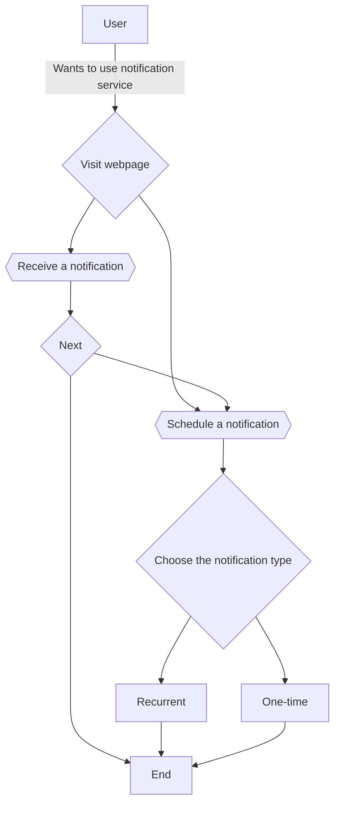

# self-help-notifications

```mermaid
flowchart TD
    user[User]
    user -->|Wants to use notification service| visit{Visit webpage}
    visit --> schedule{{Schedule a notification}}
    visit --> receive{{Receive a notification}}
    receive --> next{Next}
    next --> end_chart[End]
    next --> schedule
    schedule --> choose_type{Choose the notification type}
    choose_type --> recurrent[Recurrent]
    choose_type --> one_time[One-time]
    recurrent --> end_chart
    one_time --> end_chart
```